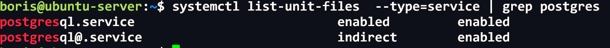
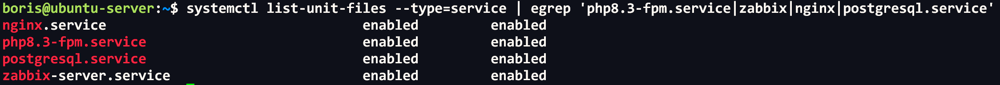
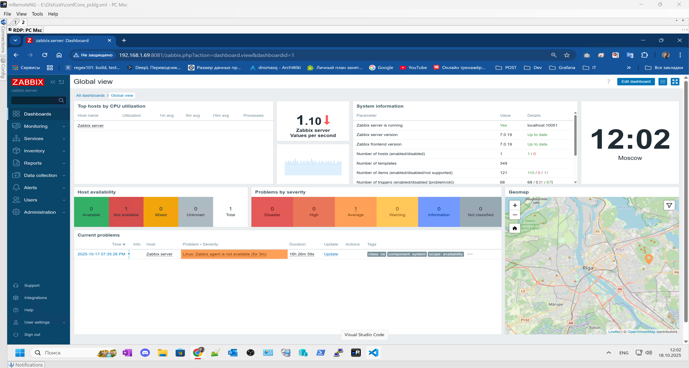
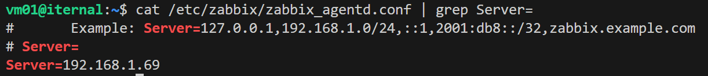
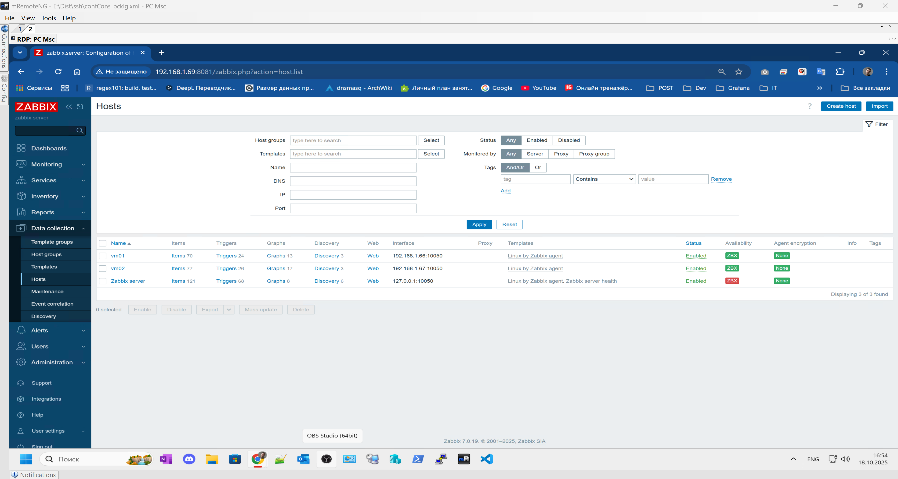
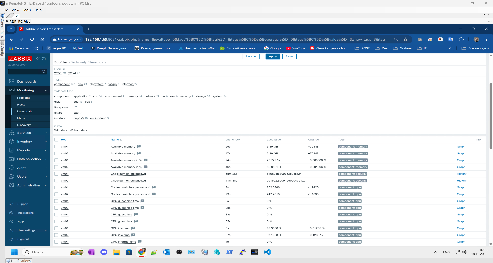
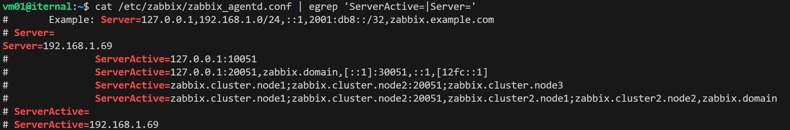
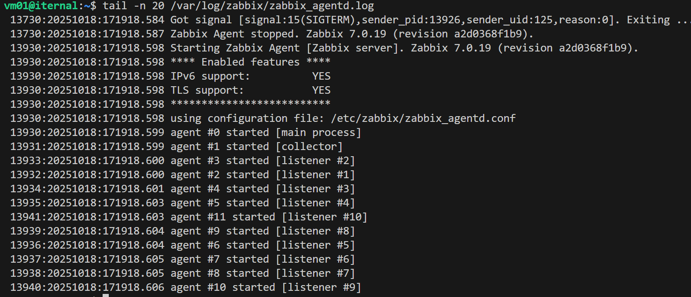

# Домашнее задание к занятию "`Система мониторинга Zabbix`" - `Борис Сидоров`
   
---
---

### Задание 1

Установите Zabbix Server с веб-интерфейсом.

#### Процесс выполнения
1. Выполняя ДЗ, сверяйтесь с процессом отражённым в записи лекции.
2. Установите PostgreSQL. Для установки достаточна та версия, что есть в системном репозитороии Debian 11.
3. Пользуясь конфигуратором команд с официального сайта, составьте набор команд для установки последней версии Zabbix с поддержкой PostgreSQL и Apache.
4. Выполните все необходимые команды для установки Zabbix Server и Zabbix Web Server.

#### Требования к результатам 
1. Прикрепите в файл README.md скриншот авторизации в админке.
2. Приложите в файл README.md текст использованных команд в GitHub.

---

### Решение 1

Для установки системы мониторинга zabbix была выбрана следующая конфигурация:
```
- версия Zabbix
  7.0 LTS
- дистрибутив ОС
  Ubuntu
- версия ОС
  24.04 (Noble)
- компонент zabbix
  Server, Frontend, Agent
- база данных
  PostgreSQL
- веб-сервер
  nginx
```

Получив сгенерированную инструкцию с официального сайта приступил к развертыванию zabbix сервера.

Сперва установил пакет БД **PostgreSQL** из стандартного репозитория **ubuntu**


Далее уже использовал предложенную инструкцию от zabbix

```bash
# Установите репозиторий Zabbix
wget https://repo.zabbix.com/zabbix/7.0/ubuntu/pool/main/z/zabbix-release/zabbix-release_latest_7.0+ubuntu24.04_all.deb
dpkg -i zabbix-release_latest_7.0+ubuntu24.04_all.deb
apt update


# Установите Zabbix сервер, веб-интерфейс
apt install zabbix-server-pgsql zabbix-frontend-php php8.3-pgsql zabbix-nginx-conf zabbix-sql-scripts

# Создайте базу данных (использовал метод команд для скриптов)
su - postgres -c 'psql --command "CREATE USER zabbix WITH PASSWORD '\'пароль\'';"'
su - postgres -c 'psql --command "CREATE DATABASE zabbix OWNER zabbix;"'

# На хосте Zabbix сервера импортируйте начальную схему и данные. Вам будет предложено ввести недавно созданный пароль.
zcat /usr/share/zabbix-sql-scripts/postgresql/server.sql.gz | sudo -u zabbix psql zabbix

# Настройте базу данных для Zabbix сервера. Отредактируйте файл /etc/zabbix/zabbix_server.conf
DBPassword=password
```

Так, как на целевом хосте ранее уже был развернуть **gitlab** в котором используется nginx на портах **80** и **8080** я отредактировал файл **/etc/zabbix/nginx.conf** под порт **8081**


Включив и перезапустив все установленные демоны проверяю их состояние


Перейдя по ip хоста и порту 8081 настроил подключение web интерфейса zabbix


---
---

### Задание 2

Установите Zabbix Agent на два хоста.

#### Процесс выполнения
1. Выполняя ДЗ, сверяйтесь с процессом отражённым в записи лекции.
2. Установите Zabbix Agent на 2 вирт.машины, одной из них может быть ваш Zabbix Server.
3. Добавьте Zabbix Server в список разрешенных серверов ваших Zabbix Agentов.
4. Добавьте Zabbix Agentов в раздел Configuration > Hosts вашего Zabbix Servera.
5. Проверьте, что в разделе Latest Data начали появляться данные с добавленных агентов.

#### Требования к результатам
1. Приложите в файл README.md скриншот раздела Configuration > Hosts, где видно, что агенты подключены к серверу
2. Приложите в файл README.md скриншот лога zabbix agent, где видно, что он работает с сервером
3. Приложите в файл README.md скриншот раздела Monitoring > Latest data для обоих хостов, где видны поступающие от агентов данные.
4. Приложите в файл README.md текст использованных команд в GitHub

---

### Решение 2

Для решения данного задания буду использовать 2 поднятые VM через virtual box на Ubuntu
Для установки zabbix агента через официальную документацию генерирую подходящую мне по параметрам инструкцию:
```
- версия Zabbix
  7.0 LTS
- дистрибутив ОС
  Ubuntu
- версия ОС
  24.04 (Noble)
- компонент zabbix
  Agent
```
По сути процесс установки такой же, даже проще, так как нам нужно скачать deb пакет с репозиторием zabbix, а далее обновить кеш apt и выполнить установку агента

```bash
wget https://repo.zabbix.com/zabbix/7.0/ubuntu/pool/main/z/zabbix-release/zabbix-release_latest_7.0+ubuntu24.04_all.deb
dpkg -i zabbix-release_latest_7.0+ubuntu24.04_all.deb
apt update

apt install zabbix-agent

systemctl restart zabbix-agent
systemctl enable zabbix-agent
```

Самое главное на каждом хосте отредактировать конфигурационный файл 
**/etc/zabbix/zabbix_agentd.conf**


далее перезапустить демон и проверить статус

В web интерефейся добавил хосты, добавил их в группу и применил шаблон **Linux by Zabbix agent** для сбора метрик.

Скрин подключенных хостов


Скрин поступающих данных с подключенных хостов


Из важного, я закомментировал в конфигурационном файле директиву ServerActive для отключения подключения хоста к забикс серверу, оставил только Server


Лог zabbix agent


---
---

## Задание 3 со звёздочкой*

Установите Zabbix Agent на Windows (компьютер) и подключите его к серверу Zabbix.

#### Требования к результатам
1. Приложите в файл README.md скриншот раздела Latest Data, где видно свободное место на диске C:

## Критерии оценки

1. Выполнено минимум 2 обязательных задания
2. Прикреплены требуемые скриншоты и тексты 
3. Задание оформлено в шаблоне с решением и опубликовано на GitHub

## Решение 3

