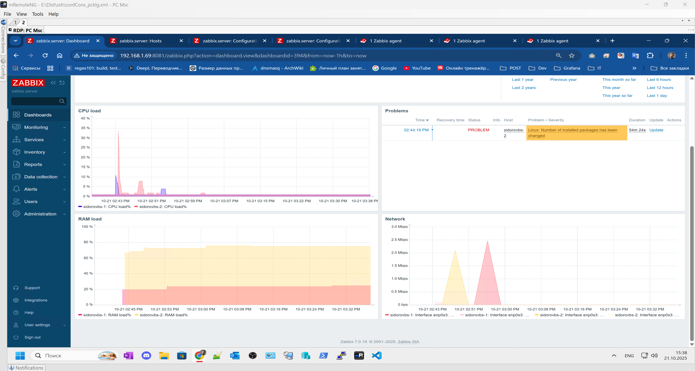

# Домашнее задание к занятию "`Система мониторинга Zabbix. Часть 2`" - `Борис Сидоров`

---
---

### Задание 1
Создайте свой шаблон, в котором будут элементы данных, мониторящие загрузку CPU и RAM хоста.

#### Процесс выполнения
1. Выполняя ДЗ сверяйтесь с процессом отражённым в записи лекции.
2. В веб-интерфейсе Zabbix Servera в разделе Templates создайте новый шаблон
3. Создайте Item который будет собирать информацию об загрузке CPU в процентах
4. Создайте Item который будет собирать информацию об загрузке RAM в процентах

#### Требования к результату
- [ ] Прикрепите в файл README.md скриншот страницы шаблона с названием «Задание 1»

 ---

### Решение 1

Для создания нового шаблона перешел в меню templates: **Data collection > templates**
Задал понятное имя для нового шаблона **CPU and RAM**, а также принадлежность к новой группе my_groups:

для нового шаблона так же задал два макроса со значением **5** и **15**. Данные макросы буду использовать для указания период обновления, так как система мониторинга тестовая, значения указаны низкие для комфортного тестирования.

следующим шагом создал необходимые items для моего шаблона.
Первый items будет отображать процент использования RAM на хосте. Для этого использовал:
- **Name** RAM load%
- **Type** Zabbix agent
- **Key** vm.memory.size[pused]
- **Unit** %
- **Update interval** {$UPDATE_TIME1}

для реализации метри по общего процента нагрузки CPU я использовал 2 items. В первом из типа агента взял ключ по выводу процента бездействия CPU:
- **Name** CPU idle%
- **Type** Zabbix agent
- **Key** system.cpu.util[,idle]
- **Unit** %
- **Update interval** {$UPDATE_TIME1}

а второй items использовал type Calculated в котором будет высчитывать процент из простой формулы. 100 - последние данные простоя CPU:
- **Name** CPU load%
- **Type** Calculated
- **Key** cpu.totalload (уникальное придуманное имя ключа)
- **Formula** 100 - last(//system.cpu.util[,idle]) 
- **Unit** %
- **Update interval** {$UPDATE_TIME1}

В итоге получился следующий шаблон:

---
---

### Задание 2
Добавьте в Zabbix два хоста и задайте им имена <фамилия и инициалы-1> и <фамилия и инициалы-2>. Например: ivanovii-1 и ivanovii-2.

#### Процесс выполнения
1. Выполняя ДЗ сверяйтесь с процессом отражённым в записи лекции.
2. Установите Zabbix Agent на 2 виртмашины, одной из них может быть ваш Zabbix Server
3. Добавьте Zabbix Server в список разрешенных серверов ваших Zabbix Agentов
4. Добавьте Zabbix Agentов в раздел Configuration > Hosts вашего Zabbix Servera
5. Прикрепите за каждым хостом шаблон Linux by Zabbix Agent
6. Проверьте что в разделе Latest Data начали появляться данные с добавленных агентов

#### Требования к результату
- [ ] Результат данного задания сдавайте вместе с заданием 3

 ---

### Решение 2

Хосты были добавлены ещё на этапе настройки zabbix, по требованию задания отредактировал названия хостов.

---
---

### Задание 3
Привяжите созданный шаблон к двум хостам. Также привяжите к обоим хостам шаблон Linux by Zabbix Agent.

#### Процесс выполнения
1. Выполняя ДЗ сверяйтесь с процессом отражённым в записи лекции.
2. Зайдите в настройки каждого хоста и в разделе Templates прикрепите к этому хосту ваш шаблон
3. Так же к каждому хосту привяжите шаблон Linux by Zabbix Agent
4. Проверьте что в раздел Latest Data начали поступать необходимые данные из вашего шаблона

#### Требования к результату
- [ ] Прикрепите в файл README.md скриншот страницы хостов, где будут видны привязки шаблонов с названиями «Задание 2-3». Хосты должны иметь зелёный статус подключения

 ---

 ### Решение 3

Так как в zabbix нет возможности добавить два шаблона в которых есть items с одними и теми же ключами, я **удалил** эти ключи из шаблона **Linux by Zabbix agent**  тем самым мой кастомный шаблон будет дополнять шаблон предоставленный из коробки.

итоговый скрин в разделе **monitoring > hosts**

---
---

### Задание 4
Создайте свой кастомный дашборд.

#### Процесс выполнения
1. Выполняя ДЗ сверяйтесь с процессом отражённым в записи лекции.
2. В разделе Dashboards создайте новый дашборд
3. Разместите на нём несколько графиков на ваше усмотрение.

#### Требования к результату
- [ ] Прикрепите в файл README.md скриншот дашборда с названием «Задание 4»

 ---

### Решение 4

Создал новую доску где разместил 3 графика по нагрузке CPU, RAM, NET, также добавил виджет с появляющимися проблемами

---
---

### Задание 5* со звёздочкой
Создайте карту и расположите на ней два своих хоста.

#### Процесс выполнения
1. Настройте между хостами линк.
2. Привяжите к линку триггер, связанный с agent.ping одного из хостов, и установите индикатором сработавшего триггера красную пунктирную линию.
3. Выключите хост, чей триггер добавлен в линк. Дождитесь срабатывания триггера.

#### Требования к результату
- [ ] Прикрепите в файл README.md скриншот карты, где видно, что триггер сработал, с названием «Задание 5» 

 ---

### Решение 5

Перед созданием карты нашел в сети схему маленького офиса и загрузил её в настройках **Administration > general > image > type Background**. Затем в меню **Monitoring > Maps** уже дефолтную карту **Local network** отредактировал выставив ширину и высоту подходящую под скачанное изображение, в поле **Background image** выбрал свой фон загруженный ранее. На карте добавил два схематичных объекта которыми будут выступать хосты созданные в предыдущем задании, в качесте имени использовал макрос **{HOST.NAME}**.

Перед созданием связи между хостами я создал для этой цели триггер для **items agent.ping**:
- **name**: Agent on {HOST.NAME} is unvailable
- **Expression**: nodata(/Linux by Zabbix agent/agent.ping,1m)=1

Триггер будет срабатывать если значение **nodata** будет возвращаться **0** и проверка будет осуществляться раз в минуту. Главное, что я изменил период работы **items Zabbix agent ping** на **30s** во избежания ложных данных от триггера.

возвращаясь к создаваемой карте между хостов сделал связь и поставил триггер в случае если на первом хосте не будет связи с zabbix агентом. Когда триггер сработает выбрал окраску связи в красную пунктирную линию

в итоге карта выглядит следующим образом

отключу zabbix agent на первом хосте и посмотрю, что произойдет

---
---

### Задание 6* со звёздочкой
Создайте UserParameter на bash и прикрепите его к созданному вами ранее шаблону. Он должен вызывать скрипт, который:
- при получении 1 будет возвращать ваши ФИО,
- при получении 2 будет возвращать текущую дату.

#### Требования к результату
- [ ] Прикрепите в файл README.md код скрипта, а также скриншот Latest data с результатом работы скрипта на bash, чтобы был виден результат работы скрипта при отправке в него 1 и 2
 
 ---

### Решение 6

---
---

### Задание 7* со звёздочкой
Доработайте Python-скрипт из лекции, создайте для него UserParameter и прикрепите его к созданному вами ранее шаблону. 
Скрипт должен:
- при получении 1 возвращать ваши ФИО,
- при получении 2 возвращать текущую дату,
- делать всё, что делал скрипт из лекции.

- [ ] Прикрепите в файл README.md код скрипта в Git. Приложите в Git скриншот Latest data с результатом работы скрипта на Python, чтобы были видны результаты работы скрипта при отправке в него 1, 2, -ping, а также -simple_print.*
 
 ---

### Решение 7

---
---

### Задание 8* со звёздочкой

Настройте автообнаружение и прикрепление к хостам созданного вами ранее шаблона.

#### Требования к результату
- [ ] Прикрепите в файл README.md скриншот правила обнаружения, а также скриншот страницы Discover, где видны оба хоста.*

 ---

### Решение 8

---
---

### Задание 9* со звёздочкой

Доработайте скрипты Vagrant для 2-х агентов, чтобы они были готовы к автообнаружению сервером, а также имели на борту разработанные вами ранее параметры пользователей.

- [ ] Приложите в GitHub файлы Vagrantfile и zabbix-agent.sh.*

## Критерии оценки

1. Выполнено минимум 4 обязательных задания
2. Прикреплены требуемые скриншоты, код и файлы 
3. Задание оформлено в шаблоне с решением и опубликовано на GitHub

---

### Решение 9

---
---

