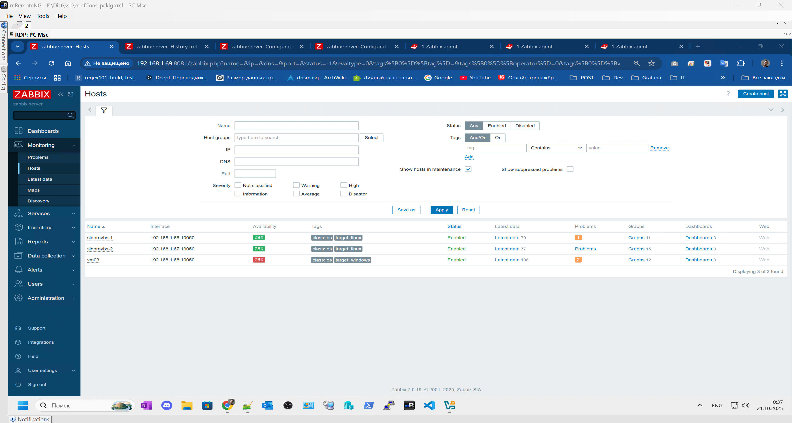
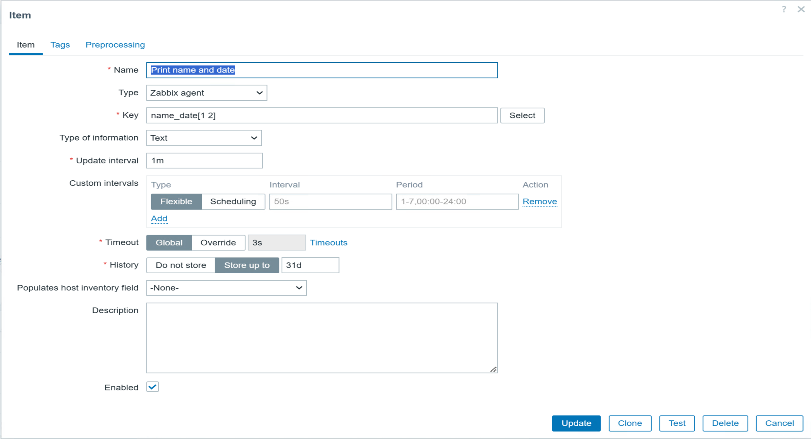
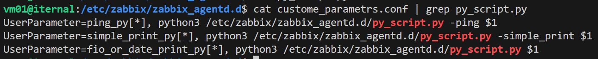

# Домашнее задание к занятию "`Система мониторинга Zabbix. Часть 2`" - `Борис Сидоров`

---
---

### Задание 1
Создайте свой шаблон, в котором будут элементы данных, мониторящие загрузку CPU и RAM хоста.

#### Процесс выполнения
1. Выполняя ДЗ сверяйтесь с процессом отражённым в записи лекции.
2. В веб-интерфейсе Zabbix Servera в разделе Templates создайте новый шаблон
3. Создайте Item который будет собирать информацию об загрузке CPU в процентах
4. Создайте Item который будет собирать информацию об загрузке RAM в процентах

#### Требования к результату
- [ ] Прикрепите в файл README.md скриншот страницы шаблона с названием «Задание 1»

 ---

### Решение 1

Для создания нового шаблона перешел в меню templates: **Data collection > templates**
Задал понятное имя для нового шаблона **CPU and RAM**, а также принадлежность к новой группе my_groups:


для нового шаблона так же задал два макроса со значением **5** и **15**. Данные макросы буду использовать для указания период обновления, так как система мониторинга тестовая, значения указаны низкие для комфортного тестирования.


следующим шагом создал необходимые items для моего шаблона.
Первый items будет отображать процент использования RAM на хосте. Для этого использовал:
- **Name** RAM load%
- **Type** Zabbix agent
- **Key** vm.memory.size[pused]
- **Unit** %
- **Update interval** {$UPDATE_TIME1}


для реализации метри по общего процента нагрузки CPU я использовал 2 items. В первом из типа агента взял ключ по выводу процента бездействия CPU:
- **Name** CPU idle%
- **Type** Zabbix agent
- **Key** system.cpu.util[,idle]
- **Unit** %
- **Update interval** {$UPDATE_TIME1}


а второй items использовал type Calculated в котором будет высчитывать процент из простой формулы. 100 - последние данные простоя CPU:
- **Name** CPU load%
- **Type** Calculated
- **Key** cpu.totalload (уникальное придуманное имя ключа)
- **Formula** 100 - last(//system.cpu.util[,idle]) 
- **Unit** %
- **Update interval** {$UPDATE_TIME1}


**Исправил наименование шаблона по требованию задания "Zadanie 1"**


---
---

### Задание 2
Добавьте в Zabbix два хоста и задайте им имена <фамилия и инициалы-1> и <фамилия и инициалы-2>. Например: ivanovii-1 и ivanovii-2.

#### Процесс выполнения
1. Выполняя ДЗ сверяйтесь с процессом отражённым в записи лекции.
2. Установите Zabbix Agent на 2 виртмашины, одной из них может быть ваш Zabbix Server
3. Добавьте Zabbix Server в список разрешенных серверов ваших Zabbix Agentов
4. Добавьте Zabbix Agentов в раздел Configuration > Hosts вашего Zabbix Servera
5. Прикрепите за каждым хостом шаблон Linux by Zabbix Agent
6. Проверьте что в разделе Latest Data начали появляться данные с добавленных агентов

#### Требования к результату
- [ ] Результат данного задания сдавайте вместе с заданием 3

 ---

### Решение 2

Хосты были добавлены ещё на этапе настройки zabbix, по требованию задания отредактировал названия хостов.


---
---

### Задание 3
Привяжите созданный шаблон к двум хостам. Также привяжите к обоим хостам шаблон Linux by Zabbix Agent.

#### Процесс выполнения
1. Выполняя ДЗ сверяйтесь с процессом отражённым в записи лекции.
2. Зайдите в настройки каждого хоста и в разделе Templates прикрепите к этому хосту ваш шаблон
3. Так же к каждому хосту привяжите шаблон Linux by Zabbix Agent
4. Проверьте что в раздел Latest Data начали поступать необходимые данные из вашего шаблона

#### Требования к результату
- [ ] Прикрепите в файл README.md скриншот страницы хостов, где будут видны привязки шаблонов с названиями «Задание 2-3». Хосты должны иметь зелёный статус подключения

 ---

 ### Решение 3

Так как в zabbix нет возможности добавить два шаблона в которых есть items с одними и теми же ключами, я **удалил** эти ключи из шаблона **Linux by Zabbix agent**  тем самым мой кастомный шаблон будет дополнять шаблон предоставленный из коробки.


В качестве доработки прикрепляю верный скрин в разделе **Data collection > Hosts** где отчетливо видно прикрепленные шаблоны к хостам. Как ранее уже описывал, конфликтующие ключи я удалил из шаблона Linux by Zabbix agent, таким образом конфликт ключей был устранен и шаблоны возможно прикрепить к одному хосту.


---
---

### Задание 4
Создайте свой кастомный дашборд.

#### Процесс выполнения
1. Выполняя ДЗ сверяйтесь с процессом отражённым в записи лекции.
2. В разделе Dashboards создайте новый дашборд
3. Разместите на нём несколько графиков на ваше усмотрение.

#### Требования к результату
- [ ] Прикрепите в файл README.md скриншот дашборда с названием «Задание 4»

 ---

### Решение 4

Создал свой dashboards с наименованием “Задание 4” как требовалось в задании. Разместил в нем два графика, в одном привязал созданные ранее items по нагрузке CPU и RAM, во втором использовал уже items предоставленный из коробки по отправке бит в секунду. Так же добавил элемент по авто обнаружению новых хостов. В качестве доработки добавил ещё один элемент в виде информации в сотах, где отображается последний пинг до заббикс сервера, item был использован созданный через custom parameters реализованный в следующих заданиях.


---
---

### Задание 5* со звёздочкой
Создайте карту и расположите на ней два своих хоста.

#### Процесс выполнения
1. Настройте между хостами линк.
2. Привяжите к линку триггер, связанный с agent.ping одного из хостов, и установите индикатором сработавшего триггера красную пунктирную линию.
3. Выключите хост, чей триггер добавлен в линк. Дождитесь срабатывания триггера.

#### Требования к результату
- [ ] Прикрепите в файл README.md скриншот карты, где видно, что триггер сработал, с названием «Задание 5» 

 ---

### Решение 5

Перед созданием карты нашел в сети схему маленького офиса и загрузил её в настройках **Administration > general > image > type Background**. Затем в меню **Monitoring > Maps** уже дефолтную карту **Local network** отредактировал выставив ширину и высоту подходящую под скачанное изображение, в поле **Background image** выбрал свой фон загруженный ранее. На карте добавил два схематичных объекта которыми будут выступать хосты созданные в предыдущем задании, в качесте имени использовал макрос **{HOST.NAME}**.

Перед созданием связи между хостами я создал для этой цели триггер для **items agent.ping**:
- **name**: Agent on {HOST.NAME} is unvailable
- **Expression**: nodata(/Linux by Zabbix agent/agent.ping,1m)=1


Триггер будет срабатывать если значение **nodata** будет возвращаться **0** и проверка будет осуществляться раз в минуту. Главное, что я изменил период работы **items Zabbix agent ping** на **30s** во избежания ложных данных от триггера.


возвращаясь к создаваемой карте между хостов сделал связь и поставил триггер в случае если на первом хосте не будет связи с zabbix агентом. Когда триггер сработает выбрал окраску связи в красную пунктирную линию


в итоге карта выглядит следующим образом


отключу zabbix agent на первом хосте и посмотрю, что произойдет


---
---

### Задание 6* со звёздочкой
Создайте UserParameter на bash и прикрепите его к созданному вами ранее шаблону. Он должен вызывать скрипт, который:
- при получении 1 будет возвращать ваши ФИО,
- при получении 2 будет возвращать текущую дату.

#### Требования к результату
- [ ] Прикрепите в файл README.md код скрипта, а также скриншот Latest data с результатом работы скрипта на bash, чтобы был виден результат работы скрипта при отправке в него 1 и 2
 
 ---

### Решение 6

Первым делом приступил к написания основного файл скритпа который будет выполнять поставленную задачу, напечатать ФИО при передаваемом аргументе со значением 1, напечатать текущую дату при передаваемом аргументе со значением 2. Скрипт **name_date.sh** получился таким:
```bash
#!/bin/bash
VALID_ARG=(1 2)

is_valid_args(){
        local arg="$1"
        for v in "${VALID_ARG[@]}"; do
                if [[ "$v" == "$arg" ]]; then
                        return 0
                fi
        done
        return 1
}

custom_parameters(){
    local is_first=true

    for arg in "$@"; do

        if [[ "$is_first" == false ]]; then
            echo -n " "
        fi

        if  [[ "$arg" == "1" ]]; then echo -n "Сидоров Борис Сергеевич";
        elif [[ "$arg" == "2" ]]; then echo -n "$(date "+%Y-%m-%d %H:%M:%S")"
        fi

        is_first=false
    done 
    echo           
}

all_valid=true
for arg in "$@"; do
    if ! is_valid_args "$arg"; then
        echo "Invalid argument: $arg"
        all_valid=false
    fi
done

if [[ "$#" -gt 0 && "$#" -lt 3 && "$all_valid" == true ]]; then
    if is_valid_args "$1"; then
        custom_parameters "$@"
    else echo "Invalid argument: $1"
    fi
else echo "Usage: <1|2>"
fi
```

Для пользовательских параметров можно было сделать намного проще без использования функции циклов в нем, не добавлять функцию на проверку валидности, но решил вспомнить пройденный материал по bash и использовать изученные навыки. В скрипте две функции на проверку валидности введенных аргументов и основная функция вывода текста в зависимости от аргумента. После функций описано условие при котором будет запускаться основная функция по выводу текста.
Разместил этот скрипт в том же пути где буду создавать конфигурационный файл 
**/etc/zabbix/zabbix_agentd.d/**

Следующим шагом создал конфигурационный файл **custome_parametrs.conf** в котором через директиву **UserParameter=** указала название ключа **name_date[*]** которое буду использовать при добавления нового items в web интерфейсе zabbix, так как скрипт на bash указал одноименное название пакета который будет запускать скрипт и абсолютный путь где располагается этот скрипт **bash /etc/zabbix/zabbix_agentd.d/name_date.sh** после чего какие аргументы можно использовать при вызове ключа **$1 $2**. В итоге получился конфигурационный файл с таким содержимым:

**UserParameter=name_date[*], bash /etc/zabbix/zabbix_agentd.d/name_date.sh $1 $2**

Таким образом по пути /etc/zabbix/zabbix_agentd.d/ у меня располагается два файла


Следующий шаг, добавляю в мой шаблон **CPU and RAM** новый items с название **Print name and date** со следующими значениями


Скрин последних данных полученных от нового items и скрин с доски куда я добавил отчет по этой метрике


---
---

### Задание 7* со звёздочкой
Доработайте Python-скрипт из лекции, создайте для него UserParameter и прикрепите его к созданному вами ранее шаблону. 
Скрипт должен:
- при получении 1 возвращать ваши ФИО,
- при получении 2 возвращать текущую дату,
- делать всё, что делал скрипт из лекции.

- [ ] Прикрепите в файл README.md код скрипта в Git. Приложите в Git скриншот Latest data с результатом работы скрипта на Python, чтобы были видны результаты работы скрипта при отправке в него 1, 2, -ping, а также -simple_print.*
 
 ---

### Решение 7

В скрипте из презентации я добавил просто два условия **elif** в котором будет проверяться передаваемый аргумент и если он равен значению **1** то будет выводиться в консоль текс, мой ФИО. В другом условие если значение равно **2** то будет выводиться переменная **current_time** в которую ранее добавил вывоз класса **datetime** внутри модуля **datetime** и метода класса **now** с формартирование **strftime**, получается что-то похоже на команду **date в bash**. По аналогии с другими импортируемыми библиотеками я также добавил и **import datetime**
По итогу скрипт получился таким:

```py
import sys
import os
import re
import datetime
if (sys.argv[1] == '-ping'): # Если -ping
	result=os.popen("ping -c 1 " + sys.argv[2]).read() # Делаем пинг по заданному адресу
	
	result=re.findall(r"time=(.*) ms", result) # Выдёргиваем из результата время
	
	print(result[0]) # Выводим результат в консоль
	
elif (sys.argv[1] == '-simple_print'): # Если simple_print
	print(sys.argv[2]) # Выводим в консоль содержимое sys.arvg[2]

elif (sys.argv[1] == '1'):
	print("Сидоров Борис Сергеевич") # Выводить в консоль ФИО

elif (sys.argv[1] == '2'):
	current_time = datetime.datetime.now().strftime("%Y-%m-%d %H:%M:%S")
	print(current_time) # Выводить в консоль дату и время

else: # Во всех остальных случаях
	print(f"unknown input: {sys.argv[1]}") # Выводим непонятый запрос в консоль
```
Далее так же как как и в предыдущем задании я разметил скрипт на python в директории **/etc/zabbix/zabbix_agentd.d/** с наименованием **py_script.py**


в файле **custome_parametrs.conf** я добавил ещё 3 ключа, 2 как было показано в лекциях и ещё одну уже под требования задачи на возможность передать один аргумент. В итоге получилось 3 ключа **ping_py[*]**; **simple_print_py[*]**; **fio_or_date_print_py[*]**.


Перезагрузив демон на хосте приступил к добавлению новых items в web интерфейсе в моём созданном шаблоне:
- **Print Date** c ключом **fio_or_date_print_py[2]** # значение 2 будет выводить дату
- **Print FIO** с ключом **fio_or_date_print_py[1]** # значение 1 будет выводить ФИО
- **Print Ping IP zabbix_server** с ключем **ping_py[192.168.1.69]** # в -ping передается явно ip адрес заббикс сервера
- **Print simple_print** с ключем **simple_print_py[test_msg]** # в -simple_print передается текст test_msg 


Скрин вывода последних данных по созданным items


---
---

### Задание 8* со звёздочкой

Настройте автообнаружение и прикрепление к хостам созданного вами ранее шаблона.

#### Требования к результату
- [ ] Прикрепите в файл README.md скриншот правила обнаружения, а также скриншот страницы Discover, где видны оба хоста.*

 ---

### Решение 8

Для начала я удалил все хосты которые были на мониторинге


далее в разделе **Data collection > Discovery** создал правило с именем **Local host** в котором будет сканироваться **диапазон ip 192.168.1.60-69** с интервалом обновления 1 минуту, тип проверки добавил **Zabbix agent "system.uname"**, уникальность устройств имя хоста и отображаемое имя также через Zabbix agent "system.uname"


теперь для того чтобы новые обнаруженные хосты сразу были добавлены в мою ранее созданную группу **local_vm** и прилинкован мой шаблон **CPU and RAM** необходимо добавить действия по обнаружению. В моей версии заббикс это делается перейдя по пути **Alerts > Actions > Discovery actions**. Создаю новый actions


и следующие операции в нем


Теперь новые просканированные хосты сразу будут добавлены в мою группу с прилинкованным шаблоном


скрин страницы обнаружения Discovery


---
---

### Задание 9* со звёздочкой

Доработайте скрипты Vagrant для 2-х агентов, чтобы они были готовы к автообнаружению сервером, а также имели на борту разработанные вами ранее параметры пользователей.

- [ ] Приложите в GitHub файлы Vagrantfile и zabbix-agent.sh.*

## Критерии оценки

1. Выполнено минимум 4 обязательных задания
2. Прикреплены требуемые скриншоты, код и файлы 
3. Задание оформлено в шаблоне с решением и опубликовано на GitHub

---

### Решение 9

Если я правильно понял, то нужно сделать так, чтобы созданные ВМ используя данный **vagrant файл** при развертке запустил скрипт **zabbix-agent.sh**, в котором описаны действия по предварительной подготовки и установки пакета zabbix-agent с уже отредактированными файлами конфигурации и добавлению кастомных скриптов для создания новых items. По итогу когда vagrant закончит работу по развертыванию ВМ, мы получим полностью настроенную ВМ под zabbix agent и без ручной донастройки агент начнет передавать данные на сервер.

Так как файл предоставленный по курсу был написан для провайдера **virtualbox**, я переписал его под плагин **vagrant-libvirt**, т.е. я буду поднимать ВМ через провайдер libvirt. Проведя все необходимые настройки на хосте я переписал vagrant file

Из основного и явного поменял зеркало для получения боксов. В блоке конфигурации самих ВМ явно указан провайдер. В блоке с переменными прописал ip адреса и hostname которые ожидаю получить на выходе. Также в файле отредактирован относительный путь до скрипта и аргумент который будет использоваться для конфигурации заббикс агента на работу с заббикс сервером. По итогу содержимого vagrant файла стало таким:

[Vagrant](files/hw-03/Vagrantfile)

```ruby
VAGRANTFILE_API_VERSION = "2"
ENV['VAGRANT_SERVER_URL'] = 'https://vagrant.elab.pro'

virt_machines=[
  {
    :hostname => "zabbixagent1",
    :ip => "192.168.1.70"
  },
  {
    :hostname => "zabbixagent2",
    :ip => "192.168.1.71"
  }
]

HOST_VM_BOX = "bento/ubuntu-24.04"
HOST_BRIDGE = "vg-bridge"
HOST_SHOW_GUI = false
HOST_MEMMORY = "512"
HOST_CPUS = 1
HOST_USER = 'test'
HOST_USER_PASS = '123456789'
HOST_UPGRADE = 'false'


Vagrant.configure("2") do |config|
	virt_machines.each do |machine|
		config.vm.box = HOST_VM_BOX
		config.vm.define machine[:hostname] do |node|
			node.vm.hostname = machine[:hostname]
			node.vm.network :public_network, 
			  :dev => HOST_BRIDGE,
			  :mode => "bridge",    
			  :type => "bridge",  
			  :ip => machine[:ip]
			node.vm.provider :libvirt do |current_vm, override|
				current_vm.memory = HOST_MEMMORY
				current_vm.cpus = HOST_CPUS
				override.vm.provision "shell", path: './ubuntu+zabbix-agent/zabbix-agent.sh', args: [	'test', 	'123456789',	'false', 	machine[:hostname], 	machine[:ip],	'192.168.1.69'], run: "once"
			end
		end
	end
end
```


В самом скрипте не стал менять пользователя и пароль. Важным изменением стало создания кастомных скриптом для возможности работы ранее созданных items, которые в свою очередь должны использовать скрипты bash и python. Эти файлы решил создавать через конструкцию hery-dock без подстановки переменных. Прислушавшись к совету, вместо многочисленных условий if else заменил на структуру case в скриптах. По итогу файл скрипта zabbix-agent.sh выглядит так:

[zabbix-agent.sh](files/hw-03/zabbix-agent.sh)


```sh
# repo override
#kz
sed -i 's/us.archive.ubuntu.com/mirror.hoster.kz/g' /etc/apt/sources.list
#ru
#sed -i 's/us.archive.ubuntu.com/mirror.linux-ia64.org/g' /etc/apt/sources.list

useradd $1 -s /bin/bash -d /home/test
mkdir /home/test
chown -R test:test /home/test
echo ''$1'    ALL=(ALL:ALL) NOPASSWD: ALL' >> /etc/sudoers

usermod --password $(openssl passwd -6 $2) root
usermod --password $(openssl passwd -6 $2) $1

if [ $3 == "true" ]; then apt upgrade -y; else echo '$3'=$3; fi

rm -Rf /etc/hosts

echo "127.0.0.1	localhost.localdomain	localhost" >> /etc/hosts
echo "$5	$4.localdomain	$4" >> /etc/hosts

echo "*******************************************************************************"
echo "************************** INSTALLING ZABBIX-AGENT ****************************"
echo "*******************************************************************************"
wget https://repo.zabbix.com/zabbix/7.4/release/ubuntu/pool/main/z/zabbix-release/zabbix-release_latest_7.4+ubuntu24.04_all.deb
dpkg -i zabbix-release_latest_7.4+ubuntu24.04_all.deb
apt update 
apt install zabbix-agent -y
sed -i "s/Server=127.0.0.1/Server=$6/g" /etc/zabbix/zabbix_agentd.conf
sed -i "s/ServerActive=127.0.0.1/# ServerActive=127.0.0.1/g" /etc/zabbix/zabbix_agentd.conf


if [[ ! -e /etc/zabbix/zabbix_agentd.d/custome_parametrs.conf ]];
then
cat > /etc/zabbix/zabbix_agentd.d/custome_parametrs.conf << 'EOF'
UserParameter=name_date[*], bash /etc/zabbix/zabbix_agentd.d/name_date.sh $1 $2
UserParameter=ping_py[*], python3 /etc/zabbix/zabbix_agentd.d/py_script.py -ping $1
UserParameter=simple_print_py[*], python3 /etc/zabbix/zabbix_agentd.d/py_script.py -simple_print $1
UserParameter=fio_or_date_print_py[*], python3 /etc/zabbix/zabbix_agentd.d/py_script.py $1
EOF
fi 

if [[ ! -e /etc/zabbix/zabbix_agentd.d/name_date.sh ]];
then
cat > /etc/zabbix/zabbix_agentd.d/name_date.sh << 'EOF'
#!/bin/bash
VALID_ARG=(1 2)

is_valid_args(){
	local arg="$1"
	for v in "${VALID_ARG[@]}"; do
		if [[ "$v" == "$arg" ]]; then
			return 0
		fi
	done
	return 1
}

custom_parameters(){
    local is_first=true

    for arg in "$@"; do

        if [[ "$is_first" == false ]]; then
            echo -n " "
        fi

        case "$arg" in
            ("1") echo -n "Сидоров Борис Сергеевич";;
            ("2") echo -n "$(date "+%Y-%m-%d %H:%M:%S")";;
        esac

        is_first=false
    done 
    echo           
}

all_valid=true
for arg in "$@"; do
    if ! is_valid_args "$arg"; then
        echo "Invalid argument: $arg"
        all_valid=false
    fi
done

if [[ "$#" -gt 0 && "$#" -lt 3 && "$all_valid" == true ]]; then
    if is_valid_args "$1"; then
        custom_parameters "$@"
    else echo "Invalid argument: $1"
    fi
else echo "Usage: <1|2>"
fi
EOF
fi

if [[ ! -e /etc/zabbix/zabbix_agentd.d/py_script.py ]];
then
cat > /etc/zabbix/zabbix_agentd.d/py_script.py << 'EOF'
import sys
import os
import re
import datetime
match sys.argv[1]:
	case "-ping":
		result=os.popen("ping -c 1 " + sys.argv[2]).read() # Делаем пинг по заданному адресу
		result=re.findall(r"time=(.*) ms", result) # Выдёргиваем из результата время
		print(result[0]) # Выводим результат в консоль
	
	case "-simple_print":
		print(sys.argv[2]) # Выводим в консоль содержимое sys.arvg[2]

	case "1":
		print("Сидоров Борис Сергеевич") # Выводить в консоль ФИО

	case "2":
		current_time = datetime.datetime.now().strftime("%Y-%m-%d %H:%M:%S")
		print(current_time) # Выводить в консоль дату и время

	case _: # Во всех остальных случаях
		print(f"unknown input: {sys.argv[1]}") # Выводим непонятый запрос в консоль
EOF
fi

systemctl restart zabbix-agent
systemctl enable zabbix-agent

echo "*******************************************************************************"
echo "********************************* END *****************************************"
echo "*******************************************************************************"
```

Пробую запустить vagrant


Проверяю добавились ли новые хосты на zabbix сервере автоматически:


Все работает, появились новые хосты с добавленными шаблонами и группой хостов. Ip адреса те, что задавал в vagrant файле.

---
---

