# Домашнее задание к занятию "`Система мониторинга Prometheus`" - `Борис Сидоров`

---
---

### Задание 1
Установите Prometheus.

#### Процесс выполнения
1. Выполняя задание, сверяйтесь с процессом, отражённым в записи лекции
2. Создайте пользователя prometheus
3. Скачайте prometheus и в соответствии с лекцией разместите файлы в целевые директории
4. Создайте сервис как показано на уроке
5. Проверьте что prometheus запускается, останавливается, перезапускается и отображает статус с помощью systemctl

#### Требования к результату
- [ ] Прикрепите к файлу README.md скриншот systemctl status prometheus, где будет написано: prometheus.service — Prometheus Service Netology Lesson 9.4 — [Ваши ФИО]

---

### Решение 1

1. 
Создал пользователя prometheus используя команду с повышенными привилегиями 
`sudo useradd --no-create-home --shell /bin/false prometheus`
После успешного выполнения команды в системе создается пользователь **prometheus** без домашней директории и оболочки.
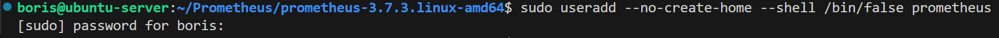

Проверю действительно ли пользователь создался
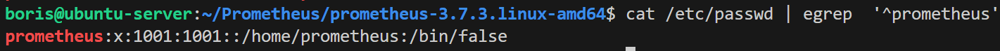
Да, пользователь появился в системе.

2. 
Иду на официальный github репозиторий с релизами prometheus
`https://github.com/prometheus/prometheus/release`
Беру ссылку на последнюю версию под ОС linux и архитектуру amd64.
Скачиваю tar архив на своем сервере через утилиту wget
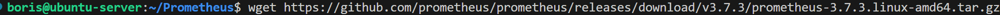

Извлекаю данные из архива и перехожу в директорию для проверки содержимого
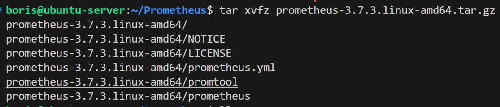

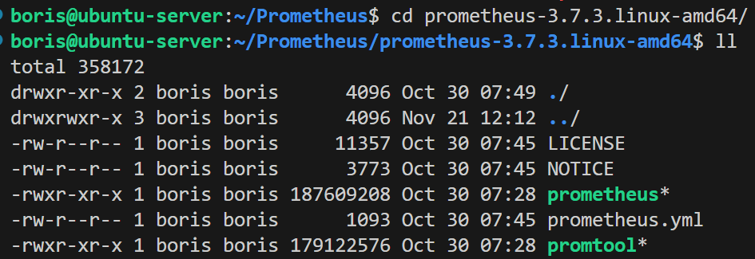

Перемещаю скачанные бинарные файлы в директорию `/usr/local/bin/`
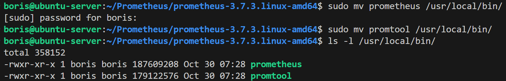

Меняю владельца и группу на ранее созданного пользователя **prometheus**
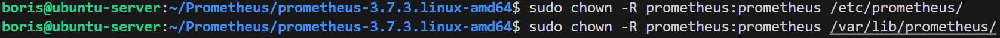

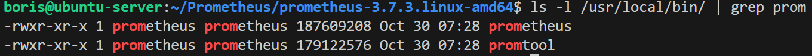

Перед тем как тестировать запуск сервиса необходимо создать дополнительные директории для конфигурационного файла, библиотек и других важных компонентов. Так же необходимо для этих директорий поменять владельца и группу на prometheus
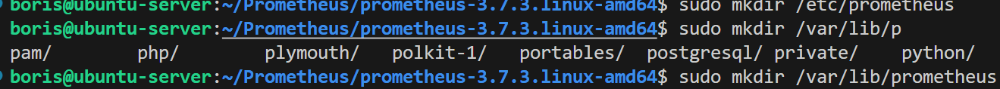

не забыть перенести конфигурационный файл prometheus.yml в созданную директорию /etc/prometheus/ и проверить на корректность владельца и группу файла.

После всех проверок пробую запустить сервис с дополнительными параметрами:
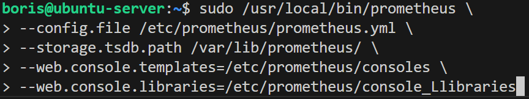

В конфигурационном файле порт указан 9090, пробую открыть web интерфейс и проверить работу сервиса
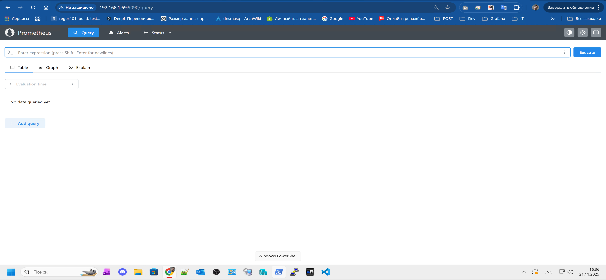

Все хорошо, сервис корректно запустился.

3. 
Для создания своего сервиса приступил к написанию юнит файла. Создал файл
`/etc/systemd/system/prometheus.service`
Наполнил файл следующими данными:
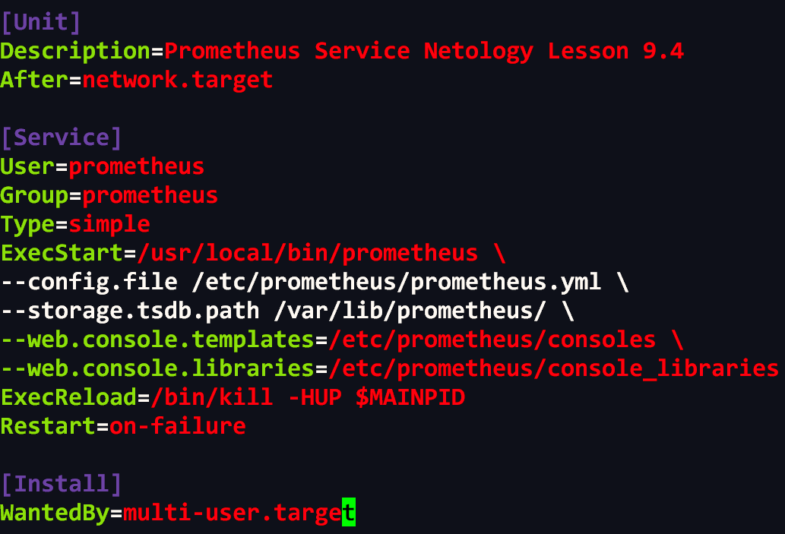

Проверю запуск модуля службы.
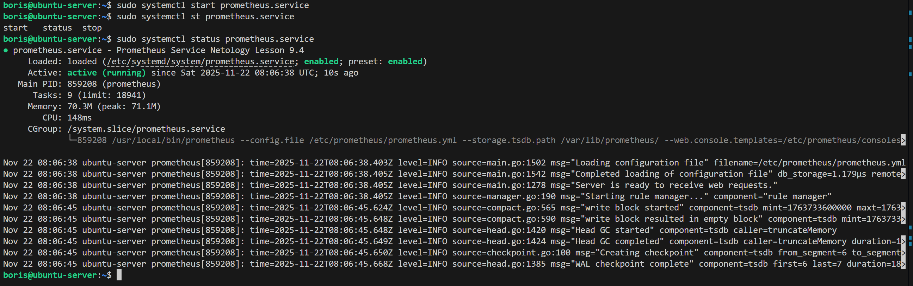

4. 
Редактирую unit файл под требования задания и пробую разные опции, **reload**, **restart**.
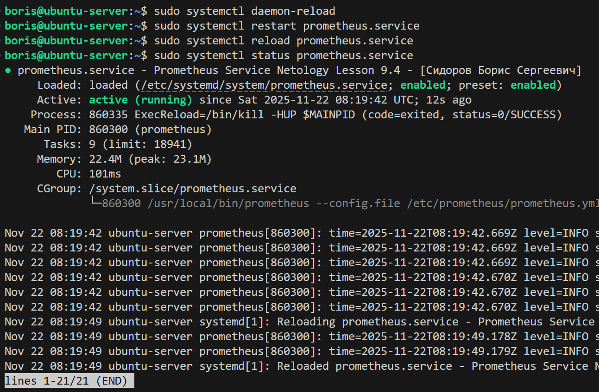

---
---

### Задание 2
Установите Node Exporter.

#### Процесс выполнения
1. Выполняя ДЗ сверяйтесь с процессом отражённым в записи лекции.
3. Скачайте node exporter приведённый в презентации и в соответствии с лекцией разместите файлы в целевые директории
4. Создайте сервис для как показано на уроке
5. Проверьте что node exporter запускается, останавливается, перезапускается и отображает статус с помощью systemctl

#### Требования к результату
- [ ] Прикрепите к файлу README.md скриншот systemctl status node-exporter, где будет написано: node-exporter.service — Node Exporter Netology Lesson 9.4 — [Ваши ФИО]

---

### Решение 2

1. 
Процесс установки **node_exporter** схож с prometheus единственное, что я изменил это подход к размещению бинарного файла в системе и предоставления прав. 

Создаю пользователя для **node_exporter**
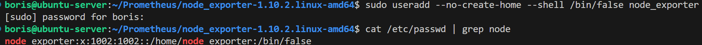

Перемещаю бинарный файл в директорию `/usr/local/bin/` и выставляю владельца **node_exporter** для бинарного файла
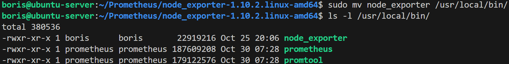

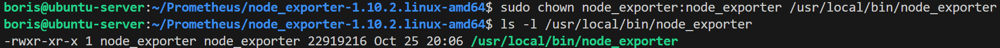

2. 
Создаю сервис для node_exporter. Создаю юнит файл со следующим наполнением:
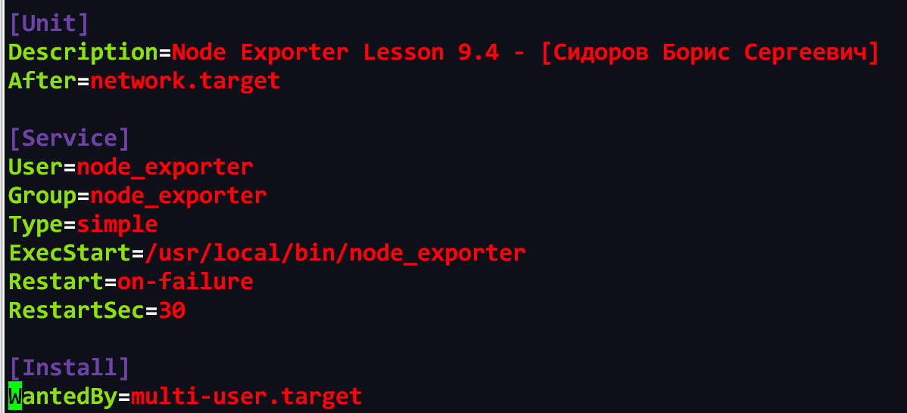

Пробую запустить службу
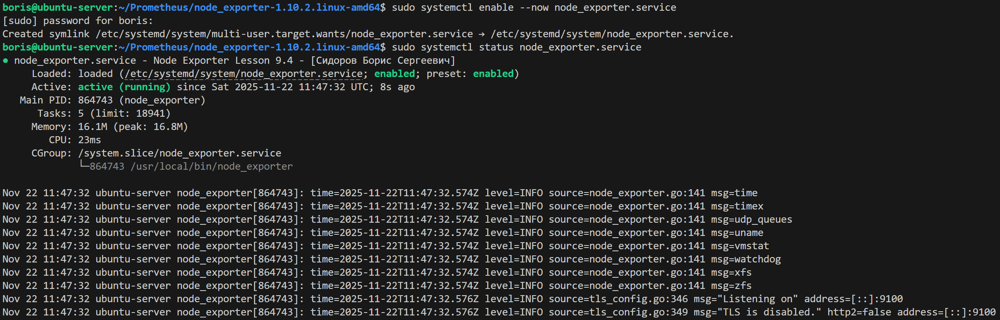

Все работает и вижу что сервис открыт на порту **9100**

3. 
Пробую остановить и перезапустить созданный модуль службы **node_exporter.service**
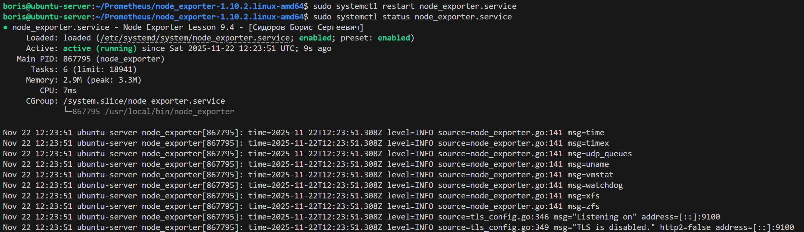

Restart работает, сервис корректно перезапускается. Остановка сервиса так же корректно работает.

---
---

### Задание 3
Подключите Node Exporter к серверу Prometheus.

#### Процесс выполнения
1. Выполняя ДЗ сверяйтесь с процессом отражённым в записи лекции.
2. Отредактируйте prometheus.yaml, добавив в массив таргетов установленный в задании 2 node exporter
3. Перезапустите prometheus
4. Проверьте что он запустился

#### Требования к результату
- [ ] Прикрепите к файлу README.md скриншот конфигурации из интерфейса Prometheus вкладки Status > Configuration
- [ ] Прикрепите к файлу README.md скриншот из интерфейса Prometheus вкладки Status > Targets, чтобы было видно минимум два эндпоинта

---
## Дополнительные задания со звёздочкой*
Эти задания дополнительные. Их можно не выполнять. Это не повлияет на зачёт. Вы можете их выполнить, если хотите глубже разобраться в материале.

---

### Решение 3

1. 
Редактирую файл `/etc/prometheus/prometheus.yml`, в файле я не буду добавлять таргет в существующей джобе job_name: **"prometheus"**, я создам новую джобу и там уже в таргете укажу ip и порт целевого сервиса node_exporter, в данном случае это будет локальный хост и порт 9100
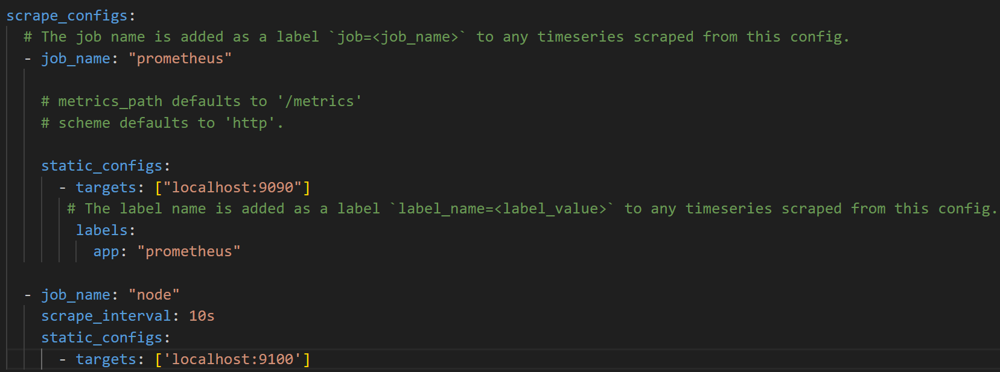

2. 
Через утилиту **promtool** проверяю корректность синтаксиса конфигурационного файла prometheus пред тем как осуществить reload службы
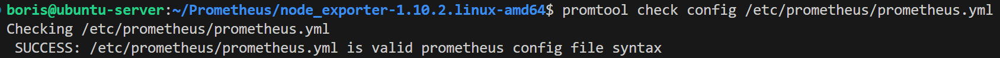

Все ок, далее можно осуществить мягкую перезагрузку службы prometheus через reload для того чтоб, сервис просто перечитал отредактированный конфигурационный файл без остановки работы самого prometheus.
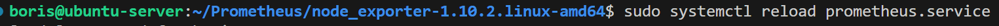

3. 
Проверю все ли запустилось и прикладываю скриншоты по требованию к задания.
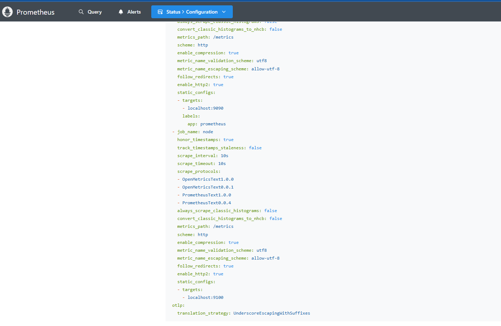

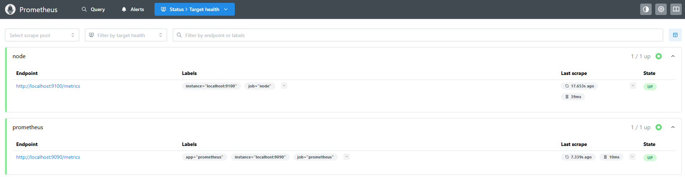

---
---

### Задание 4*
Установите Grafana.

#### Требования к результату
- [ ] Прикрепите к файлу README.md скриншот левого нижнего угла интерфейса, чтобы при наведении на иконку пользователя были видны ваши ФИО

---

### Решение 4

Установка grafana выполняется путем скачивания deb пакета и установки через dpkg -i. Далее следуя подсказкам в выводе активировал модуль службы и запустил grafana. Залогинился и отредактировал учетную записи в web интерфейсе графана
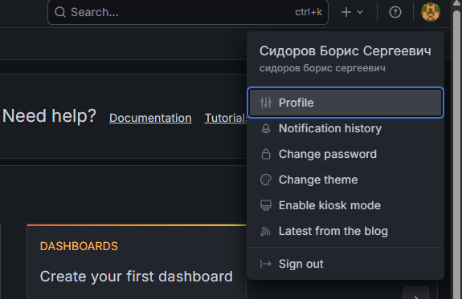

---
---

### Задание 5*
Интегрируйте Grafana и Prometheus.

---

### Решение 5

Перейдя в web интерфейс grafana первым делом подключил источник данных. Поле **Connections > Data source** добавил prometheus и ip:port где развернут prometheus.
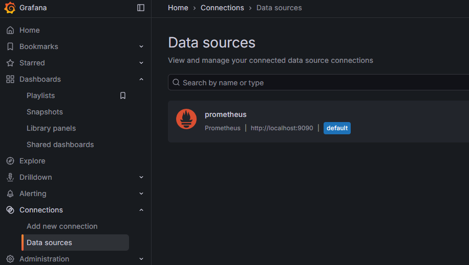 

далее добавляем дашборд, буду использовать готовый дашборд для node_exporter. Перехожу на сайт `https://grafana.com/grafana/dashboards/` и ищу интересующий меня дашборд под данные prometheus. После найденного дашборда, копирую его id. Далее вставляю этот id уже в своей графане **Home > Dashboards > Import dashboard**. После импорта данные будут визуализированы в удобные графики для читабильности и контроля состояния хоста.
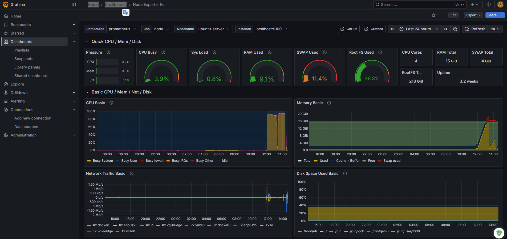

---
---